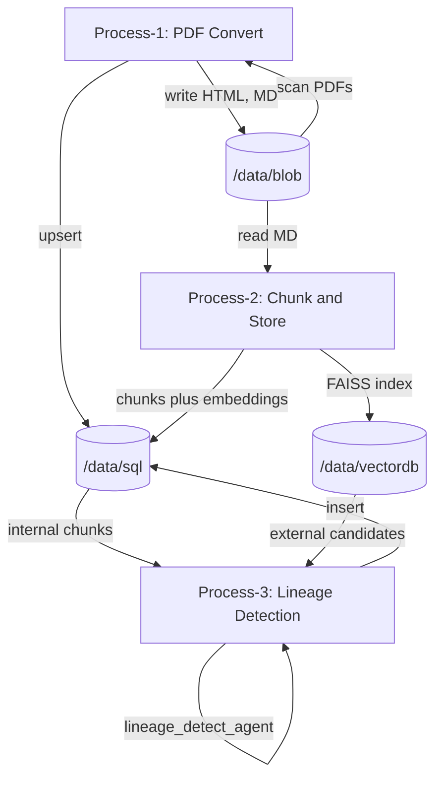
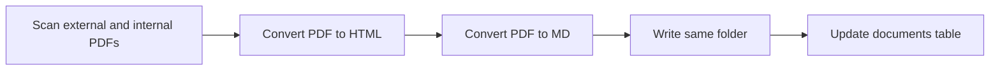
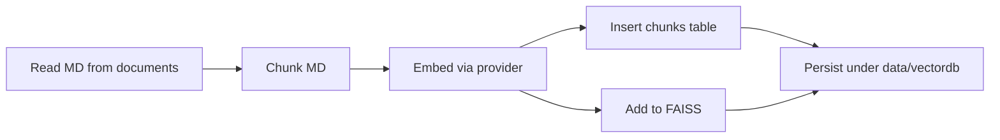
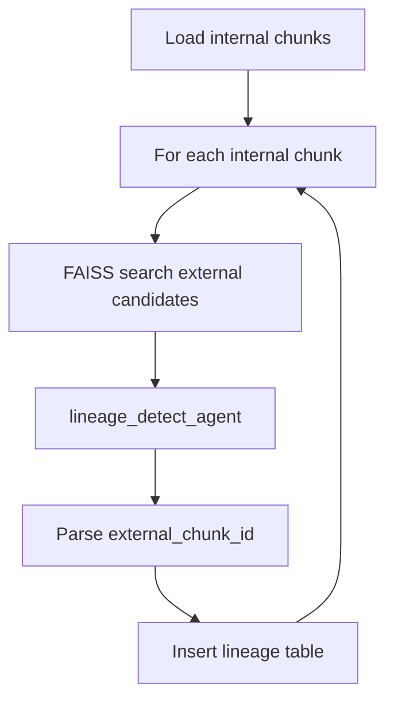

# RiseApp — Data Lineage Detection for XYZ Bank

Data lineage detection between **external** (regulatory) and **internal** (bank) policy documents: chunking, embeddings (FAISS), and a Google ADK **lineage_detect_agent** to map internal chunks to external sources.

---

## Setup

### 1. Environment and packages (uv)

- **Python 3.11+**
- Install [uv](https://github.com/astral-sh/uv) then:

```bash
cd /path/to/RiseApp
uv sync
```

This installs dependencies from `pyproject.toml` (google-adk, google-genai, pymupdf, faiss-cpu, sentence-transformers, etc.).

### 2. `.env` and config

- **`.env`** (project root): API keys and secrets. Never commit.

  - `GOOGLE_API_KEY` or `GEMINI_API_KEY`: used by Google ADK agents and Google embedding (when `embedding.provider: google`).

- **`config/config.yaml`**: paths, embedding provider, chunking, lineage, agents.

  - `data.blob`, `data.sql`, `data.vectordb`, `logs.dir`
  - `embedding.provider`: `huggingface` | `google`
  - `embedding.model`: e.g. `sentence-transformers/all-MiniLM-L6-v2` or `gemini-embedding-001`
  - `chunking.size`, `chunking.overlap`
  - `lineage.top_k`
  - `agents.lineage_detect.model`, etc.

---

## Folder structure

| Path | Purpose |
|------|--------|
| `config/` | YAML config |
| `data/blob/` | External (`external/`) and internal (`internal/`) docs; each folder has `{name}.pdf`, `{name}.html`, `{name}.md` |
| `data/sql/` | SQLite DB (`riseapp.db`): `documents`, `chunks`, `lineage` |
| `data/vectordb/` | FAISS index and `meta.json` (chunk ids, doc types) |
| `exception/` | Custom exception classes |
| `logger/` | Logging setup; logs under `logs/` |
| `logs/` | Log files |
| `src/` | Application code |
| `src/agents/` | ADK agents (`lineage_detect_agent`, `brand_agent`) and `prompts/` |
| `src/chunking/` | MD chunking |
| `src/db/` | DB connection and repositories |
| `src/embedding/` | Embedding interface + HuggingFace / Google impl |
| `src/processes/` | Process-1 (convert), Process-2 (chunk+store), Process-3 (lineage) |
| `src/vectordb/` | FAISS store |
| `test/` | Pytest tests |
| `utils/` | Config, file I/O, etc. |

---

## Running the pipeline

From project root:

```bash
uv run python main.py convert      # Process-1: PDF -> HTML/MD, update documents
uv run python main.py chunk-store  # Process-2: Chunk, embed, store DB + FAISS
uv run python main.py lineage      # Process-3: Lineage detection, store lineage
uv run python main.py all          # Run convert -> chunk-store -> lineage
```

Or:

```bash
uv run riseapp convert
uv run riseapp chunk-store
uv run riseapp lineage
uv run riseapp all
```

### Lineage agent (ADK web)

From project root:

```bash
uv run adk web --adk.agents.source-dir=src/agents/lineage_detect_agent
```

Or `cd src/agents/lineage_detect_agent` and run `adk web` if ADK discovers `root_agent` from that module.

---

## Testing

```bash
uv run pytest test/ -v
```

Or, if using `pip` and a venv:

```bash
pip install -r requirements.txt   # Windows: faiss-cpu may fail; use WSL/conda or skip Process-2/3
python -m pytest test/ -v
```

- Unit: chunker, embedding (HuggingFace), DB repos, FAISS.
- Some tests use a temporary DB; integration-style tests use `data/blob` and config.
- **Windows**: `faiss-cpu` often has no PyPI wheel. Use WSL, conda, or run only `test_chunker` and `test_db`. Process-2/3 need faiss.

## Verification checklist

- **Setup**: `uv sync`; `.env` with `GOOGLE_API_KEY` or `GEMINI_API_KEY`.
- **Run**: `uv run python main.py all` (or `convert` → `chunk-store` → `lineage`).
- **Agent (ADK web)**: `uv run adk web` with `--adk.agents.source-dir=src/agents/lineage_detect_agent`.

---

## Flows (Mermaid)

### End-to-end



### Process-1 (PDF convert)



### Process-2 (Chunk and store)



### Process-3 (Lineage)



---

## Lineage queries

- **Internal -> External**: join `lineage` with `chunks` (internal `chunk_id` -> external `chunk_id`).
- **External -> Internal**: same tables, join from `external_chunk_id` to `internal_chunk_id`.
