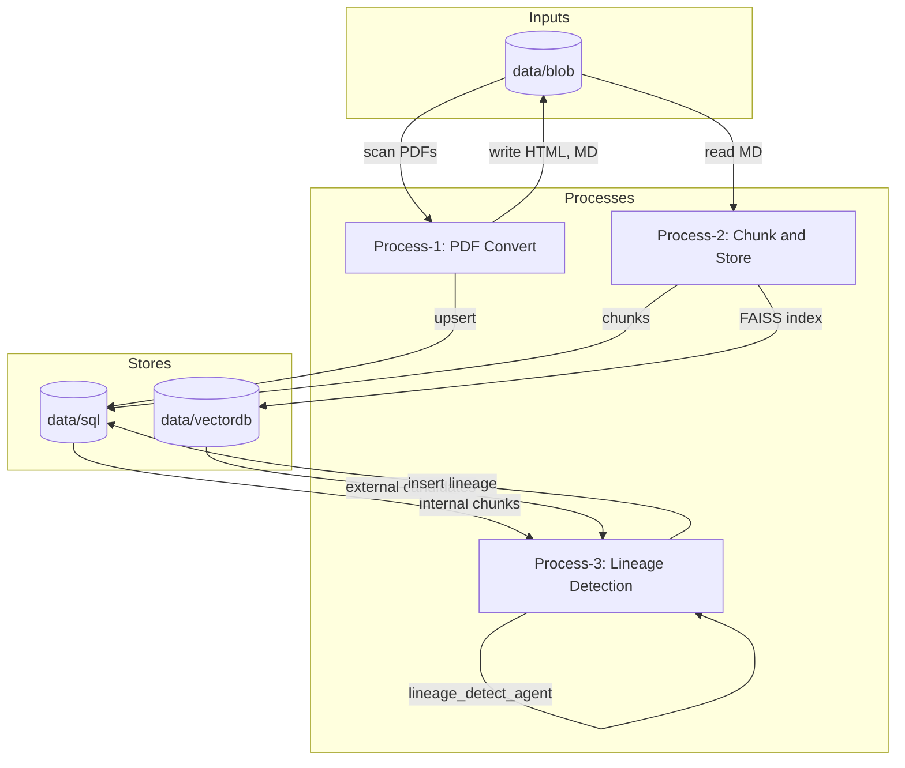
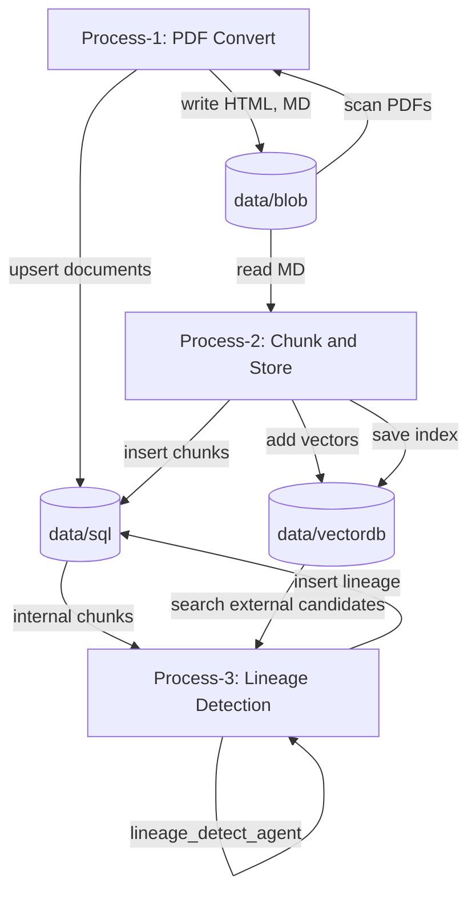
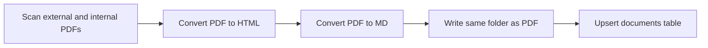
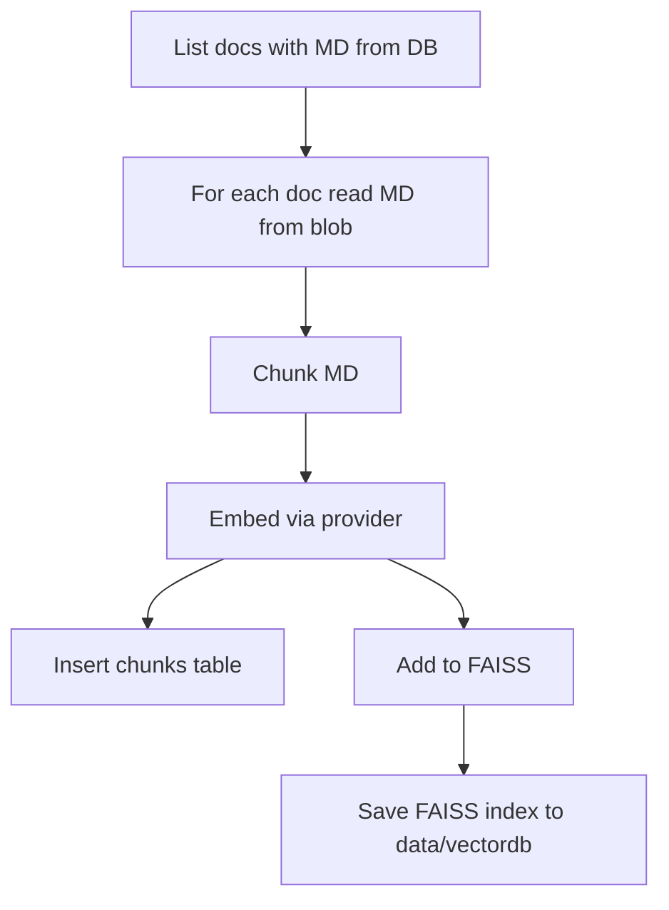
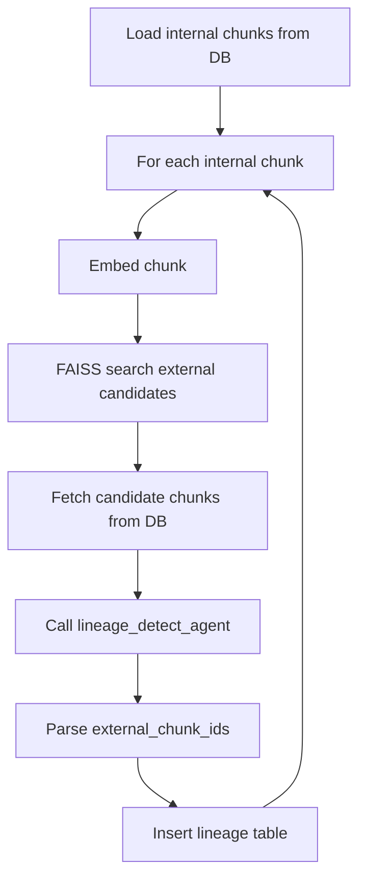

# RiseApp — Data Lineage Detection for XYZ Bank

RiseApp detects **data lineage** between **external** (regulatory) and **internal** (bank) policy documents. It chunks markdown from both sources, builds FAISS vector indexes, and uses a **Google ADK lineage-detection agent** to map each internal chunk to the external chunk(s) it interprets. Results are stored in SQLite for bidirectional querying (external → internal or internal → external).

---

## Introduction

**External documents** are publicly available regulatory policies. **Internal documents** are the bank’s interpretations and implementation guidance. RiseApp:

1. **Tracks** documents under `data/blob` (PDF, HTML, MD) in a SQLite `documents` table.
2. **Chunks** all `.md` files, embeds them (HuggingFace or Google), and stores chunks in SQLite plus a FAISS index under `data/vectordb`.
3. **Runs** a lineage agent per internal chunk: FAISS retrieves candidate external chunks, the LLM selects which external chunk(s) the internal one interprets, and links are written to a `lineage` table.

The database supports joins to query lineage in both directions. The embedding implementation is **pluggable** (HuggingFace `all-MiniLM-L6-v2` or Google embeddings), and the lineage agent is runnable via **ADK web** for interactive testing.

---

## Architecture Overview



- **Process-1**: Scans `data/blob` for PDFs, converts to HTML/MD, updates `documents`.
- **Process-2**: Reads MD from blob (using `documents`), chunks, embeds, writes **chunks** to SQL and **vectors** to FAISS (`data/vectordb`).
- **Process-3**: Loads internal chunks from SQL, embeds and queries FAISS for external candidates, calls the lineage agent, writes **lineage** to SQL.

---

## Setup

### 1. Environment and packages (uv)

- **Python 3.11+**
- Install [uv](https://github.com/astral-sh/uv), then:

```bash
cd /path/to/RiseApp
uv sync
```

This installs dependencies from `pyproject.toml` (e.g. `google-adk`, `google-genai`, `pymupdf`, `faiss-cpu`, `sentence-transformers`).

### 2. `.env` and config

- **`.env`** (project root): API keys. Do not commit.

  - `GOOGLE_API_KEY` or `GEMINI_API_KEY` — used by the lineage agent and by Google embedding when `embedding.provider: google`.

- **`config/config.yaml`**: Paths, embedding, chunking, lineage, agents.

  - `data.blob`, `data.sql`, `data.vectordb`, `logs.dir`
  - `embedding.provider`: `huggingface` | `google`
  - `embedding.model`: e.g. `model/all-MiniLM-L6-v2` (local) or `sentence-transformers/all-MiniLM-L6-v2` or `gemini-embedding-001`
  - `chunking.size`, `chunking.overlap`
  - `lineage.top_k`
  - `agents.lineage_detect.model`

---

## Folder Structure

| Path | Purpose |
|------|---------|
| `config/` | YAML config |
| `data/blob/` | **External** (`external/`) and **internal** (`internal/`) docs. Per-doc folders contain `{name}.pdf`, `{name}.html`, `{name}.md` |
| `data/sql/` | SQLite DB (`riseapp.db`): `documents`, `chunks`, `lineage` |
| `data/vectordb/` | FAISS index and `meta.json` (chunk ids, doc types) |
| `exception/` | Custom exception classes |
| `logger/` | Logging setup; logs under `logs/` |
| `logs/` | Log files |
| `model/` | Optional local embedding model (e.g. `model/all-MiniLM-L6-v2`) |
| `src/` | Application code |
| `src/agents/` | `lineage_detect_agent` and `prompts/` |
| `src/chunking/` | MD chunking |
| `src/db/` | SQLite connection and repositories |
| `src/embedding/` | Embedding interface; HuggingFace and Google implementations |
| `src/processes/` | Process-1 (convert), Process-2 (chunk+store), Process-3 (lineage) |
| `src/vectordb/` | FAISS store |
| `test/` | Pytest tests |
| `utils/` | Config loader, file I/O |

---

## Configuration Reference

| Key | Description | Example |
|-----|-------------|---------|
| `data.blob` | Root for external/internal docs | `data/blob` |
| `data.sql` | SQLite directory | `data/sql` |
| `data.vectordb` | FAISS output directory | `data/vectordb` |
| `logs.dir` | Log directory | `logs` |
| `embedding.provider` | `huggingface` or `google` | `huggingface` |
| `embedding.model` | Model name or local path | `model/all-MiniLM-L6-v2` |
| `chunking.size` | Chunk size (characters) | `512` |
| `chunking.overlap` | Overlap between chunks | `64` |
| `lineage.top_k` | FAISS candidates per internal chunk | `5` |
| `agents.lineage_detect.model` | LLM for lineage agent | `gemini-2.0-flash` |

---

## Running the Pipeline

From the project root:

```bash
uv run python main.py convert      # Process-1: PDF → HTML/MD, update documents
uv run python main.py chunk-store  # Process-2: Chunk, embed, store in DB + FAISS
uv run python main.py lineage      # Process-3: Lineage detection, store lineage
uv run python main.py all          # Run convert → chunk-store → lineage
```

Or, if the `riseapp` entrypoint is installed:

```bash
uv run riseapp convert
uv run riseapp chunk-store
uv run riseapp lineage
uv run riseapp all
```

### Lineage agent (ADK web)

To run the lineage agent in the ADK web UI:

```bash
uv run adk web --adk.agents.source-dir=src/agents/lineage_detect_agent
```

The agent exposes `root_agent` for discovery. Use the chat interface to exercise it.

---

## Database Schema and Lineage Queries

### Tables

- **`documents`**: `id`, `relative_path`, `doc_type` (`external`|`internal`), `name`, `has_pdf`, `has_html`, `has_md`, `created_at`, `updated_at`.
- **`chunks`**: `id`, `document_id`, `chunk_index`, `content`, `metadata`, `created_at`.
- **`lineage`**: `id`, `internal_chunk_id`, `external_chunk_id`, `confidence`, `created_at`.

### Querying lineage

- **Internal → external**: join `lineage` with `chunks` on `internal_chunk_id` to get external chunk(s) for each internal chunk.
- **External → internal**: same join, but follow `external_chunk_id` to list internal chunks that interpret a given external chunk.

---

## Flows (Mermaid)

### End-to-end



### Process-1: PDF convert



### Process-2: Chunk and store



### Process-3: Lineage detection



---

## Testing

```bash
uv run pytest test/ -v
```

Or with `pip` and a venv:

```bash
pip install -r requirements.txt
python -m pytest test/ -v
```

- **Unit**: Chunker, embedding (HuggingFace), DB repos, FAISS.
- **Integration**: Process-1 (in-memory DB, mocked where needed).
- **Windows**: `faiss-cpu` may have no wheel; use WSL/conda or run only `test_chunker` and `test_db` if FAISS is unavailable.

---

## Verification Checklist

- **Setup**: `uv sync`; `.env` with `GOOGLE_API_KEY` or `GEMINI_API_KEY` if using Google embedding/agent.
- **Run**: `uv run python main.py all` (or `convert` → `chunk-store` → `lineage`).
- **Agent**: `uv run adk web --adk.agents.source-dir=src/agents/lineage_detect_agent`.

---

## Embedding and Lineage Agent

- **Embedding**: Implementations live in `src/embedding/`. The factory chooses HuggingFace or Google based on `embedding.provider`. Use a local model path (e.g. `model/all-MiniLM-L6-v2`) when the model is cloned under the project.
- **Lineage agent**: Implemented in `src/agents/lineage_detect_agent/`, with prompts in `src/agents/prompts/` (`lineage_detect_system.md`, `lineage_detect_match.md`). Process-3 calls `detect_lineage(internal_chunk, candidates)` and persists results to the `lineage` table.
