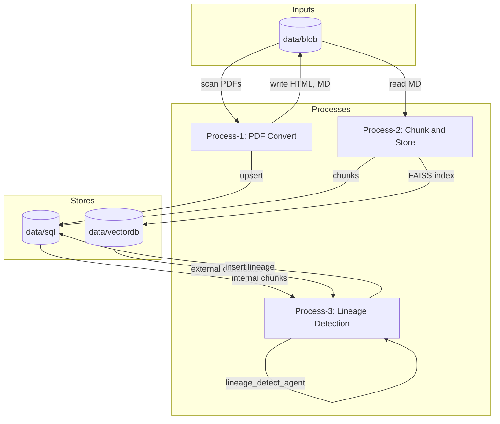
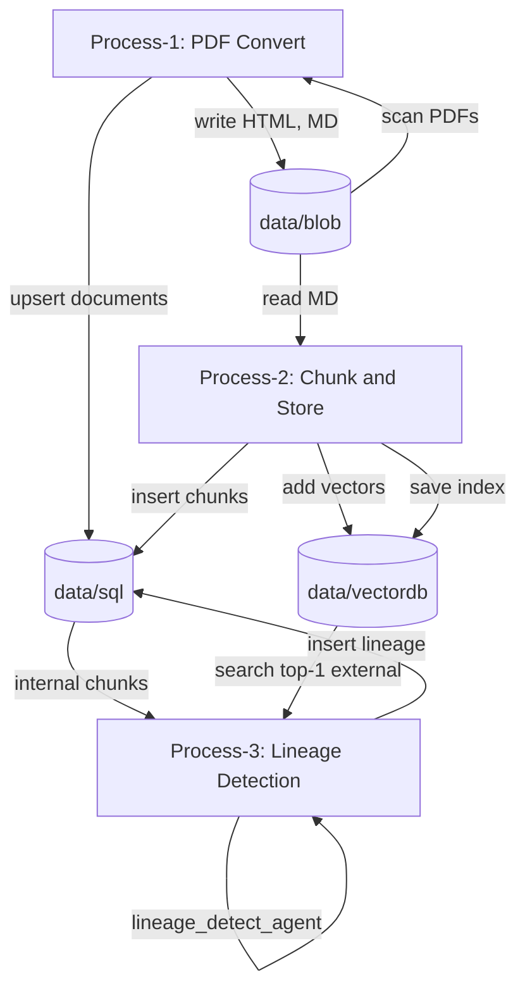
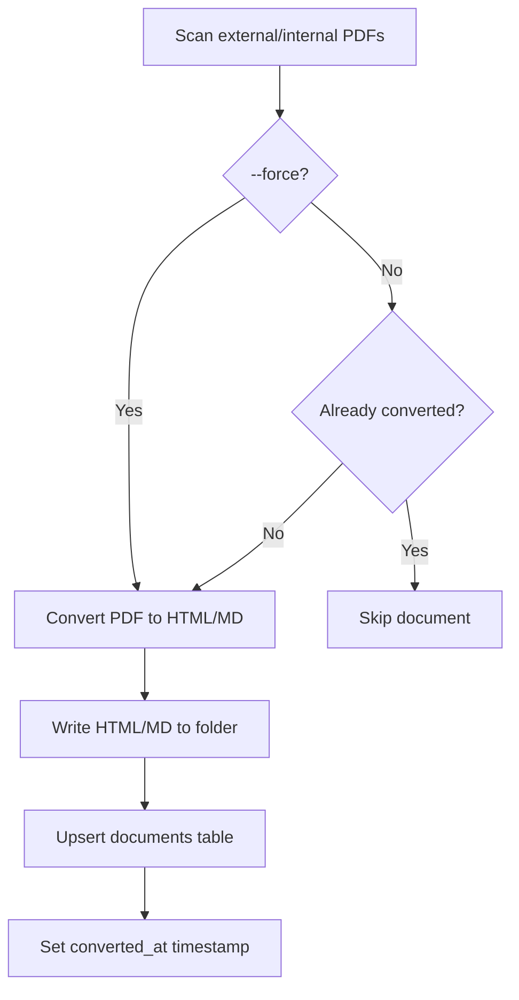
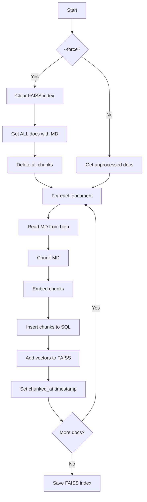
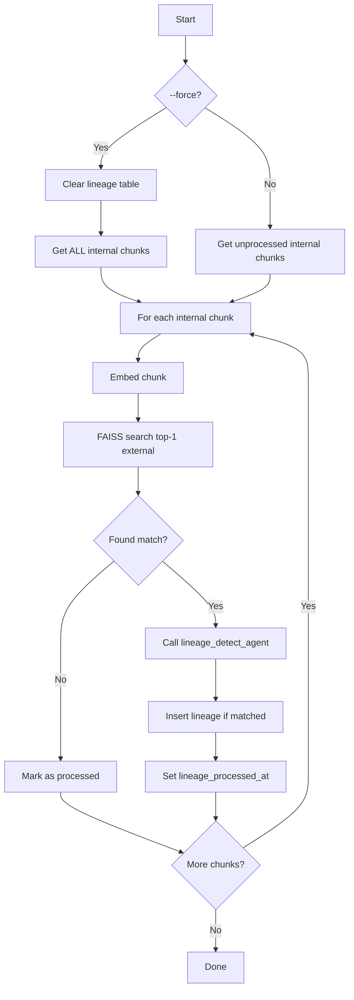

# RiseApp — Data Lineage Detection for XYZ Bank

RiseApp detects **data lineage** between **external** (regulatory) and **internal** (bank) policy documents. It chunks markdown from both sources, builds FAISS vector indexes, and uses a **Google ADK lineage-detection agent** to map each internal chunk to the external chunk(s) it interprets. Results are stored in SQLite for bidirectional querying (external → internal or internal → external).

---

## Introduction

**External documents** are publicly available regulatory policies. **Internal documents** are the bank’s interpretations and implementation guidance. RiseApp:

1. **Tracks** documents under `data/blob` (PDF, HTML, MD) in a SQLite `documents` table.
2. **Chunks** all `.md` files, embeds them (HuggingFace or Google), and stores chunks in SQLite plus a FAISS index under `data/vectordb`.
3. **Runs** a lineage agent per internal chunk: FAISS retrieves the closest matched external chunk (via vector similarity), the LLM determines if the internal chunk interprets that external chunk, and links are written to a `lineage` table.

The database supports joins to query lineage in both directions. The embedding implementation is **pluggable** (HuggingFace `all-MiniLM-L6-v2` or Google embeddings), and the lineage agent is runnable via **ADK web** for interactive testing.

### Key Features

- **Incremental Processing**: Each process tracks what has been processed and skips already-processed items on subsequent runs.
- **Force Mode**: Use `--force` flag to reprocess everything, clearing previous results.
- **Optimized LLM Calls**: Process-3 uses only the top-1 closest match from vector search, reducing LLM API costs.

---

## Architecture Overview



- **Process-1**: Scans `data/blob` for PDFs, converts to HTML/MD, updates `documents`.
- **Process-2**: Reads MD from blob (using `documents`), chunks, embeds, writes **chunks** to SQL and **vectors** to FAISS (`data/vectordb`).
- **Process-3**: Loads internal chunks from SQL, embeds and queries FAISS for external candidates, calls the lineage agent, writes **lineage** to SQL.

---

## Setup

### 1. Environment and packages (uv)

- **Python 3.11+**
- Install [uv](https://github.com/astral-sh/uv), then:

```bash
cd /path/to/RiseApp
uv sync
```

This installs dependencies from `pyproject.toml` (e.g. `google-adk`, `google-genai`, `pymupdf`, `faiss-cpu`, `sentence-transformers`).

### 2. `.env` and config

- **`.env`** (project root): API keys. Do not commit.

  - `GOOGLE_API_KEY` or `GEMINI_API_KEY` — used by the lineage agent and by Google embedding when `embedding.provider: google`.

- **`config/config.yaml`**: Paths, embedding, chunking, lineage, agents.

  - `data.blob`, `data.sql`, `data.vectordb`, `logs.dir`
  - `embedding.provider`: `huggingface` | `google`
  - `embedding.model`: e.g. `model/all-MiniLM-L6-v2` (local) or `sentence-transformers/all-MiniLM-L6-v2` or `gemini-embedding-001`
  - `chunking.size`, `chunking.overlap`
  - `lineage.top_k`
  - `agents.lineage_detect.model`

### 3. Compare UI (optional)

The **dual-document compare** UI is a React app in `frontend/`. Build it so the API can serve it at `/compare/`:

```bash
cd frontend
npm install
npm run build
```

The build writes to `static/compare/`. The API serves the compare app at **`/compare/`** (and `/compare`). Use the hash to pick two documents, e.g. **`/compare/#/1/2`** for document ID 1 vs 2. The compare UI uses the same origin for API calls (`/api`).

---

## Folder Structure

| Path | Purpose |
|------|---------|
| `config/` | YAML config |
| `data/blob/` | **External** (`external/`) and **internal** (`internal/`) docs. Per-doc folders contain `{name}.pdf`, `{name}.html`, `{name}.md` |
| `data/sql/` | SQLite DB (`riseapp.db`): `documents`, `chunks`, `lineage` |
| `data/vectordb/` | FAISS index and `meta.json` (chunk ids, doc types) |
| `exception/` | Custom exception classes |
| `logger/` | Logging setup; logs under `logs/` |
| `logs/` | Log files |
| `model/` | Optional local embedding model (e.g. `model/all-MiniLM-L6-v2`) |
| `src/` | Application code |
| `src/agents/` | `lineage_detect_agent` and `prompts/` |
| `src/chunking/` | MD chunking |
| `src/db/` | SQLite connection and repositories |
| `src/embedding/` | Embedding interface; HuggingFace and Google implementations |
| `src/api/` | FastAPI app: documents, content, chunks, process, upload |
| `src/processes/` | Process-1 (convert), Process-2 (chunk+store), Process-3 (lineage) |
| `src/vectordb/` | FAISS store |
| `static/` | Web UI: HTML, CSS, JS (upload, documents list, view, side-by-side lineage) |
| `static/compare/` | Dual-document compare React app (built from `frontend/`) |
| `frontend/` | Vite + React compare UI source; build output goes to `static/compare/` |
| `test/` | Pytest tests (including `test_api.py` for REST API) |
| `utils/` | Config loader, file I/O |

---

## Configuration Reference

| Key | Description | Example |
|-----|-------------|---------|
| `data.blob` | Root for external/internal docs | `data/blob` |
| `data.sql` | SQLite directory | `data/sql` |
| `data.vectordb` | FAISS output directory | `data/vectordb` |
| `logs.dir` | Log directory | `logs` |
| `embedding.provider` | `huggingface` or `google` | `huggingface` |
| `embedding.model` | Model name or local path | `model/all-MiniLM-L6-v2` |
| `chunking.size` | Chunk size (characters) | `512` |
| `chunking.overlap` | Overlap between chunks | `64` |
| `lineage.top_k` | Number of closest external chunks to pass to LLM | `1` |
| `agents.lineage_detect.model` | LLM for lineage agent | `gemini-2.0-flash` |

---

## Running the Web App

The web app provides a UI for uploading PDFs, running the pipeline, listing documents, viewing content (HTML/MD), downloading PDFs, and viewing chunk lineage side-by-side.

### Start the server

From the project root:

```bash
uv run uvicorn src.api.app:app --reload --host 0.0.0.0 --port 8000
```

Then open **http://localhost:8000** in a browser. The app serves the API at `/api` and the static front-end at `/`.

### Upload & Processing

1. **Upload**: Choose **Policy (external)** or **Rules (internal)**, select a PDF, and click Upload. Files are saved under `data/blob/external/<name>/` or `data/blob/internal/<name>/`.
2. **Run pipeline**: After upload, use **Process 1 (Convert)**, **Process 2 (Chunk & Store)**, and **Process 3 (Lineage)**. If a step reports "Already processed", you can click **Yes, force** to reprocess.
3. **Documents**: List all documents or filter by External (policy) / Internal (rules). Each row shows status (Converted, Chunked) and actions: **View**, **Download PDF**.
4. **Viewing documents & lineage**: Open **View** to see the document in HTML or Markdown and a **Chunks** section. Each chunk lists **View linked chunk** links. Clicking one opens a **side-by-side** view: left = current chunk, right = linked chunk (from the other document).

### API Reference

Interactive API docs: **http://localhost:8000/docs** (Swagger UI).

| Method | Endpoint | Description |
|--------|----------|-------------|
| GET | `/api/documents` | List documents (optional `?doc_type=external` or `internal`) |
| GET | `/api/documents/{id}/content?format=html\|md\|pdf` | Document content or PDF download |
| GET | `/api/documents/{id}/chunks` | Chunks for a document with `linked_chunk_ids` |
| GET | `/api/chunks/{chunk_id}` | Full chunk content and document info |
| POST | `/api/process/1`, `/api/process/2`, `/api/process/3` | Run process (body: `{"force": false}`) |
| POST | `/api/upload` | Upload PDF (form: `file`, `doc_type=external\|internal`) |

---

## Running the Pipeline (CLI)

### What is `riseapp`?

The `riseapp` command is a CLI entrypoint defined in `pyproject.toml`:

```toml
[project.scripts]
riseapp = "main:main"
```

This means when you run `uv run riseapp`, it executes the `main()` function from `main.py`. The `uv run` command ensures the virtual environment is activated and dependencies are available.

### Basic Commands

From the project root:

```bash
uv run riseapp convert      # Process-1: PDF → HTML/MD, update documents
uv run riseapp chunk-store  # Process-2: Chunk, embed, store in DB + FAISS
uv run riseapp lineage      # Process-3: Lineage detection, store lineage
uv run riseapp all          # Run convert → chunk-store → lineage
```

Alternatively, run directly via Python:

```bash
uv run python main.py convert
uv run python main.py chunk-store
uv run python main.py lineage
uv run python main.py all
```

### Incremental vs Force Mode

By default, each process is **incremental** — it skips items that have already been processed:

- **Process-1**: Skips PDFs where `converted_at` is set and HTML/MD files exist
- **Process-2**: Skips documents where `chunked_at >= updated_at`
- **Process-3**: Skips internal chunks where `lineage_processed_at` is set

To **force reprocessing**, use the `--force` (or `-f`) flag:

```bash
uv run riseapp convert --force      # Re-convert all PDFs, overwrite HTML/MD
uv run riseapp chunk-store --force  # Clear vector store, re-chunk all documents
uv run riseapp lineage --force      # Clear lineage table, reprocess all chunks
uv run riseapp all --force          # Force all three processes
```

| Flag | Process-1 Effect | Process-2 Effect | Process-3 Effect |
|------|------------------|------------------|------------------|
| (none) | Skip converted docs | Skip chunked docs | Skip processed chunks |
| `--force` | Re-convert all PDFs | Clear FAISS, re-chunk all | Clear lineage, reprocess all |

### Lineage Agent (ADK Web)

To run the lineage agent in the ADK web UI for interactive testing:

```bash
uv run adk web --adk.agents.source-dir=src/agents/lineage_detect_agent
```

The agent exposes `root_agent` for discovery. Use the chat interface to exercise it.

---

## Database Schema and Lineage Queries

### Tables

- **`documents`**: Tracks all documents (PDFs) in the blob.
  - `id`, `relative_path`, `doc_type` (`external`|`internal`), `name`
  - `has_pdf`, `has_html`, `has_md` — flags for file existence
  - `created_at`, `updated_at` — timestamps
  - `converted_at` — timestamp when Process-1 converted the PDF (NULL if not converted)
  - `chunked_at` — timestamp when Process-2 chunked the document (NULL if not chunked)
  - `lineage_at` — reserved for future use

- **`chunks`**: Stores chunked content from MD files.
  - `id` (format: `{document_id}_{chunk_index}`), `document_id`, `chunk_index`, `content`, `metadata`
  - `created_at` — timestamp
  - `lineage_processed_at` — timestamp when Process-3 processed this chunk (NULL if not processed)

- **`lineage`**: Links internal chunks to external chunks they interpret.
  - `id`, `internal_chunk_id`, `external_chunk_id`, `confidence`, `created_at`

### Querying Lineage

**Internal → External**: Find external chunks that an internal chunk interprets:

```sql
SELECT l.*, c.content as external_content
FROM lineage l
JOIN chunks c ON c.id = l.external_chunk_id
WHERE l.internal_chunk_id = '2_0';
```

**External → Internal**: Find internal chunks that interpret an external chunk:

```sql
SELECT l.*, c.content as internal_content
FROM lineage l
JOIN chunks c ON c.id = l.internal_chunk_id
WHERE l.external_chunk_id = '1_0';
```

**Check Processing Status**:

```sql
-- Documents not yet converted
SELECT * FROM documents WHERE converted_at IS NULL;

-- Documents not yet chunked
SELECT * FROM documents WHERE has_md = 1 AND (chunked_at IS NULL OR updated_at > chunked_at);

-- Internal chunks not yet processed for lineage
SELECT c.* FROM chunks c
JOIN documents d ON d.id = c.document_id
WHERE d.doc_type = 'internal' AND c.lineage_processed_at IS NULL;
```

---

## Flows (Mermaid)

### End-to-end



### Process-1: PDF Convert (with --force option)



### Process-2: Chunk and Store (with --force option)



### Process-3: Lineage Detection (with --force option)



---

## Testing

### Run All Tests

```bash
uv run pytest test/ -v
```

Or with `pip` and a venv:

```bash
pip install -r requirements.txt
python -m pytest test/ -v
```

### Run Individual Test Modules

Each module can be tested independently:

```bash
# Test the chunker (text splitting logic)
uv run pytest test/test_chunker.py -v

# Test database operations (repositories, CRUD)
uv run pytest test/test_db.py -v

# Test embedding (HuggingFace model loading and embedding)
uv run pytest test/test_embedding.py -v

# Test vector database (FAISS operations)
uv run pytest test/test_vectordb.py -v

# Test Process-1 (PDF conversion flow)
uv run pytest test/test_process_1.py -v
```

### Run Specific Test Functions

```bash
# Run a specific test function
uv run pytest test/test_db.py::test_documents_crud -v

# Run tests matching a keyword
uv run pytest test/ -k "chunk" -v
```

### Test Coverage

| Test File | Module Tested | Description |
|-----------|---------------|-------------|
| `test_chunker.py` | `src/chunking/chunker.py` | Markdown chunking with size/overlap |
| `test_api.py` | `src/api/app.py` | REST API: documents, content, chunks, process, upload |
| `test_db.py` | `src/db/repositories.py` | SQLite CRUD for documents, chunks, lineage |
| `test_embedding.py` | `src/embedding/` | HuggingFace embedding model |
| `test_vectordb.py` | `src/vectordb/faiss_store.py` | FAISS index add/search/save/load |
| `test_process_1.py` | `src/processes/process_1_convert.py` | PDF → HTML/MD conversion |

### Testing Tips

- **Windows**: `faiss-cpu` may have no wheel; use WSL/conda or run only `test_chunker` and `test_db` if FAISS is unavailable.
- **Async tests**: Tests use `pytest-asyncio` with `asyncio_mode = "auto"` configured in `pyproject.toml`.
- **Isolated DB**: Tests use in-memory SQLite databases to avoid affecting production data.

---

## Verification Checklist

- **Setup**: `uv sync`; `.env` with `GOOGLE_API_KEY` or `GEMINI_API_KEY` if using Google embedding/agent.
- **Run**: `uv run python main.py all` (or `convert` → `chunk-store` → `lineage`).
- **Agent**: `uv run adk web --adk.agents.source-dir=src/agents/lineage_detect_agent`.

---

## Embedding and Lineage Agent

- **Embedding**: Implementations live in `src/embedding/`. The factory chooses HuggingFace or Google based on `embedding.provider`. Use a local model path (e.g. `model/all-MiniLM-L6-v2`) when the model is cloned under the project.
- **Lineage agent**: Implemented in `src/agents/lineage_detect_agent/`, with prompts in `src/agents/prompts/` (`lineage_detect_system.md`, `lineage_detect_match.md`). Process-3 calls `detect_lineage(internal_chunk, candidates)` and persists results to the `lineage` table.
